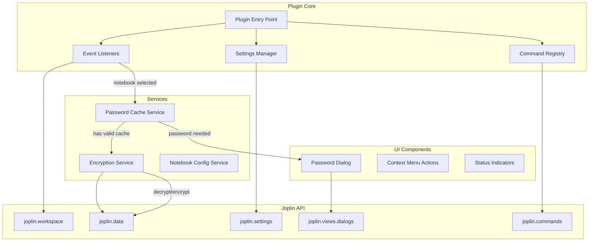
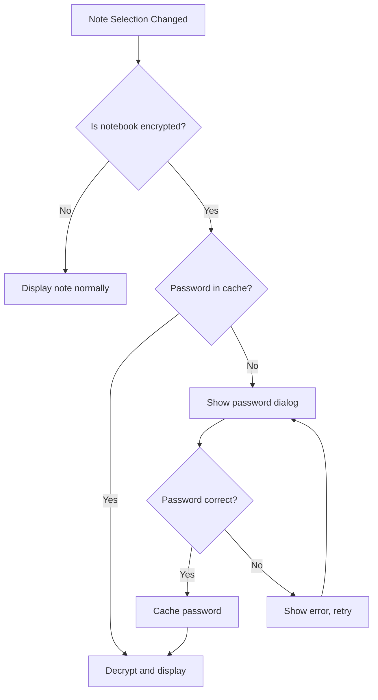

# Joplin Notebook Encryption Plugin - Architecture Document

## Overview

This plugin adds notebook-level encryption to Joplin, allowing users to protect sensitive notes with password-based encryption. When a user selects an encrypted notebook, they are prompted for the password, which is cached for a configurable duration (default 10 minutes).

## Requirements Summary

| Requirement | Decision |
|-------------|----------|
| Encryption Scope | Note body content only |
| Algorithm | AES-256-GCM (authenticated encryption) |
| Password Model | Unique password per notebook |
| Encryption Approach | Transparent (on-the-fly decrypt/encrypt) |
| Sync Compatible | Yes |
| Cache Duration | 10 minutes (configurable) |

## Architecture Diagram



## Component Details

### 1. Encryption Service

The core service responsible for encrypting and decrypting note content using AES-256-GCM.

**Key Features:**
- Uses Web Crypto API for cryptographic operations
- Generates random IV for each encryption
- Derives encryption key from password using PBKDF2
- Stores salt and IV with encrypted data

**Data Format:**
```
[4 bytes: version][16 bytes: salt][12 bytes: IV][N bytes: ciphertext][16 bytes: auth tag]
```

**Interface:**
```typescript
interface EncryptionService {
  encrypt: password: string, plaintext: string => Promise of string
  decrypt: password: string, ciphertext: string => Promise of string
  deriveKey: password: string, salt: Uint8Array => Promise of CryptoKey
  generateSalt: => Uint8Array
  generateIV: => Uint8Array
}
```

### 2. Password Cache Service

Manages in-memory caching of passwords with automatic expiration.

**Key Features:**
- Stores passwords in memory only (never persisted)
- Configurable timeout (default 10 minutes)
- Automatic cleanup on timeout
- Per-notebook password storage

**Interface:**
```typescript
interface PasswordCacheService {
  set: notebookId: string, password: string => void
  get: notebookId: string => string or null
  has: notebookId: string => boolean
  clear: notebookId: string => void
  clearAll: => void
  setTimeout: minutes: number => void
}
```

**Implementation:**
```typescript
class PasswordCache {
  private cache: Map of string to { password: string, expiry: number }
  private timeout: number // in milliseconds
  
  constructor with defaultTimeout: number = 10 * 60 * 1000 {
    this.cache = new Map
    this.timeout = defaultTimeout
  }
  
  set with notebookId: string, password: string {
    const expiry = Date.now + this.timeout
    this.cache.set with notebookId, { password, expiry }
    this.scheduleCleanup with notebookId, this.timeout
  }
  
  get with notebookId: string: string or null {
    const entry = this.cache.get with notebookId
    if not entry return null
    if Date.now greater than entry.expiry {
      this.cache.delete with notebookId
      return null
    }
    return entry.password
  }
}
```

### 3. Notebook Configuration Service

Manages the configuration of which notebooks are encrypted.

**Storage Strategy:**
- Store encrypted notebook IDs in plugin settings
- Store password verification hash (not the password) for validation
- Store encryption metadata (version, algorithm info)

**Interface:**
```typescript
interface NotebookConfig {
  id: string                    // Notebook/folder ID
  enabled: boolean              // Is encryption enabled
  passwordHash: string          // Hash for password verification
  salt: string                  // Base64 encoded salt for key derivation
  createdAt: number             // Timestamp when encryption was enabled
  version: number               // Encryption version for future migrations
}

interface NotebookConfigService {
  isEncrypted: notebookId: string => boolean
  enableEncryption: notebookId: string, password: string => Promise of void
  disableEncryption: notebookId: string, password: string => Promise of void
  verifyPassword: notebookId: string, password: string => Promise of boolean
  getConfig: notebookId: string => NotebookConfig or null
  getAllEncryptedNotebooks: => string array
}
```

### 4. Password Dialog UI

A modal dialog for password entry using Joplin dialog API.

**HTML Template:**
```html
<div class="notebook-encryption-dialog">
  <h3>Enter Password</h3>
  <p>Notebook: <strong id="notebook-name"></strong></p>
  <form name="password-form">
    <div class="form-group">
      <label for="password">Password:</label>
      <input type="password" id="password" name="password" required autofocus>
    </div>
    <div class="form-group" id="confirm-group" style="display: none;">
      <label for="confirm-password">Confirm Password:</label>
      <input type="password" id="confirm-password" name="confirmPassword">
    </div>
    <div class="error-message" id="error" style="display: none;"></div>
  </form>
</div>
```

**Dialog Types:**
1. **Unlock Dialog** - Single password field for accessing encrypted notebook
2. **Setup Dialog** - Password + confirmation for enabling encryption
3. **Change Password Dialog** - Old password + new password + confirmation

### 5. Event Listeners

Monitor Joplin workspace events to trigger encryption/decryption.

**Events to Handle:**
- `onNoteSelectionChange` - Detect when user opens a note
- `onNoteChange` - Detect when note content is modified
- `onSyncComplete` - Re-validate encrypted notes after sync

**Flow:**


### 6. Plugin Settings

Configurable settings exposed in Joplin preferences.

**Settings:**

| Setting | Type | Default | Description |
|---------|------|---------|-------------|
| `cacheTimeout` | number | 10 | Password cache duration in minutes |
| `encryptedNotebooks` | string | {} | JSON object of encrypted notebook configs |
| `showLockIndicator` | boolean | true | Show lock icon on encrypted notebooks |
| `clearCacheOnLock` | boolean | true | Clear cache when computer is locked |
| `requirePasswordOnSync` | boolean | false | Re-prompt for password after sync |

### 7. Context Menu Actions

Right-click menu options for notebooks.

**Menu Items:**
- **Enable Encryption** - Available on unencrypted notebooks
- **Disable Encryption** - Available on encrypted notebooks (requires password)
- **Change Password** - Available on encrypted notebooks
- **Lock Notebook** - Manually clear password from cache

## Security Considerations

### Password Handling
- Passwords are NEVER stored persistently
- Passwords are kept in memory only during cache window
- Use secure key derivation (PBKDF2 with high iteration count)

### Encryption
- AES-256-GCM provides authenticated encryption
- Random IV for each encryption prevents pattern analysis
- Salt per notebook prevents rainbow table attacks

### Attack Vectors Mitigated
- **Memory dump**: Passwords cleared after timeout
- **Brute force**: PBKDF2 with 100,000+ iterations
- **Replay attacks**: Unique IV per encryption
- **Tampering**: GCM authentication tag verification

### Limitations
- Note titles remain unencrypted (visible in notebook list)
- Search functionality will not work on encrypted content
- Attachments/resources are not encrypted by this plugin

## File Structure

```
joplin-notebook-encryption/
├── src/
│   ├── index.ts                 # Plugin entry point
│   ├── services/
│   │   ├── encryptionService.ts # AES-256-GCM encryption
│   │   ├── passwordCache.ts     # In-memory password cache
│   │   └── notebookConfig.ts    # Encrypted notebook management
│   ├── ui/
│   │   ├── dialogs/
│   │   │   ├── passwordDialog.ts
│   │   │   └── templates/
│   │   │       └── password.html
│   │   └── contextMenu.ts
│   ├── handlers/
│   │   ├── noteHandler.ts       # Note open/save interception
│   │   └── syncHandler.ts       # Sync event handling
│   ├── settings.ts              # Plugin settings registration
│   └── types.ts                 # TypeScript interfaces
├── tests/
│   ├── encryption.test.ts
│   ├── passwordCache.test.ts
│   └── integration.test.ts
├── manifest.json
├── package.json
├── tsconfig.json
└── README.md
```

## Implementation Phases

### Phase 1: Core Infrastructure
1. Set up plugin scaffolding with `yo joplin`
2. Implement EncryptionService with Web Crypto API
3. Implement PasswordCacheService
4. Create basic password dialog

### Phase 2: Notebook Integration
1. Implement NotebookConfigService
2. Register plugin settings
3. Add context menu actions for enable/disable encryption
4. Implement notebook selection detection

### Phase 3: Note Interception
1. Hook into note open events
2. Implement automatic decryption on note access
3. Implement automatic encryption on note save
4. Handle note content display

### Phase 4: Polish and Edge Cases
1. Add lock indicators to encrypted notebooks
2. Handle sync scenarios
3. Implement error handling and user feedback
4. Add password change functionality

### Phase 5: Testing and Documentation
1. Unit tests for encryption service
2. Integration tests for full workflow
3. User documentation
4. README and installation guide

## API Usage Examples

### Encrypting a Note
```typescript
// When saving a note in an encrypted notebook
async function saveEncryptedNote noteId: string, content: string {
  const notebookId = await getNotebookForNote noteId
  
  if notebookConfigService.isEncrypted notebookId {
    const password = passwordCache.get notebookId
    if not password {
      throw new Error - Notebook is locked
    }
    
    const encryptedContent = await encryptionService.encrypt password, content
    await joplin.data.put - notes - noteId - null - { body: encryptedContent }
  } else {
    await joplin.data.put - notes - noteId - null - { body: content }
  }
}
```

### Decrypting a Note
```typescript
// When opening a note from an encrypted notebook
async function openNote noteId: string {
  const note = await joplin.data.get - notes - noteId - { fields: - id - title - body - parent_id }
  const notebookId = note.parent_id
  
  if notebookConfigService.isEncrypted notebookId {
    const password = passwordCache.get notebookId
    if not password {
      const enteredPassword = await showPasswordDialog notebookId
      if not await notebookConfigService.verifyPassword notebookId enteredPassword {
        throw new Error - Invalid password
      }
      passwordCache.set notebookId enteredPassword
    }
    
    const decryptedContent = await encryptionService.decrypt 
      passwordCache.get notebookId 
      note.body
    return { ...note body: decryptedContent }
  }
  
  return note
}
```

## Next Steps

After reviewing this architecture document, the implementation can proceed in the following order:

1. **Initialize Project** - Run `yo joplin` to create plugin scaffold
2. **Core Services** - Implement encryption and caching services
3. **UI Components** - Create password dialogs
4. **Integration** - Hook into Joplin events and APIs
5. **Testing** - Write unit and integration tests
6. **Documentation** - Create user guide and README

---

*Document Version: 1.0*
*Last Updated: November 2024*